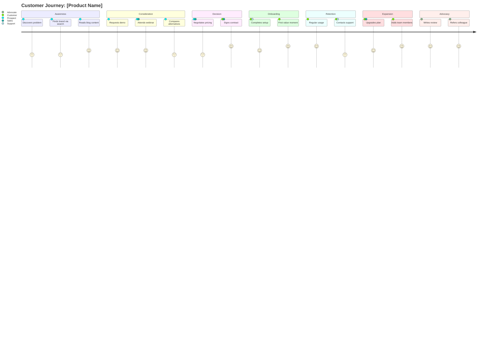

# Mermaid Diagram Requirements

Generate TWO Mermaid diagrams in the document. All diagrams must use valid syntax that renders correctly.

## 1. Journey Overview Diagram (near the top)
A simplified `journey` diagram showing the high-level flow:

## 2. Full Detail Diagram (in the dedicated section)
A more comprehensive diagram with granular touchpoints and accurate satisfaction scores (1-5) based on the analysis. Each touchpoint must have a realistic satisfaction score reflecting the emotional state described in the stage analysis.

## Satisfaction Scoring Guide

Use this scale consistently across all diagrams and analysis:

| Score | Meaning | Emotional State |
|---|---|---|
| 1 | Extremely frustrated | Angry, considering abandoning |
| 2 | Dissatisfied | Annoyed, experiencing significant friction |
| 3 | Neutral | Neither positive nor negative, functional |
| 4 | Satisfied | Positive experience, expectations met |
| 5 | Delighted | Exceeded expectations, memorable positive moment |
