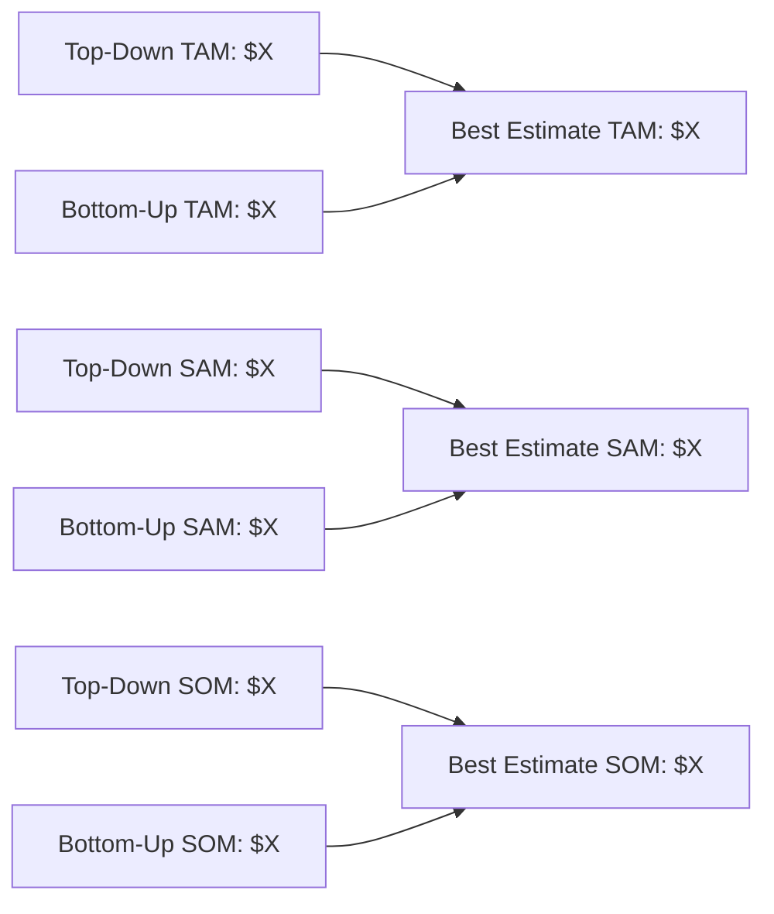
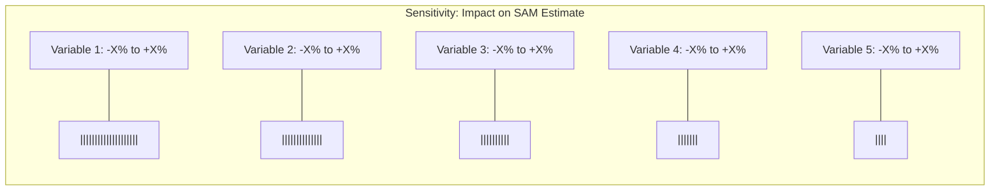
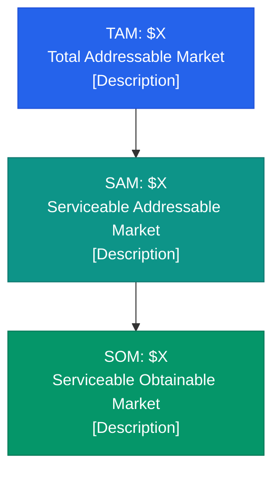

# Output Template: market-sizing.md

Generate a file called `market-sizing.md` in the current working directory (or a user-specified location) using the structure below. Make the document thorough, well-sourced, and investor-ready.

```markdown
# Market Sizing Analysis: [Product/Service]

**Industry**: [Industry]
**Geography**: [Geography]
**Target Segment**: [Target Segment]
**Analysis Date**: [Date]
**Analyst**: Marq AI Market Sizing Agent

---

## Executive Summary

[3-5 sentence summary of key findings. Lead with the bottom line: TAM, SAM, SOM numbers. Highlight the most important insight.]

### Key Figures

| Metric | Conservative | Base Case | Aggressive |
|---|---|---|---|
| **TAM** | $X | $X | $X |
| **SAM** | $X | $X | $X |
| **SOM (Year 1)** | $X | $X | $X |
| **SOM (Year 3)** | $X | $X | $X |
| **SOM (Year 5)** | $X | $X | $X |

---

## Methodology

### Definitions

- **TAM (Total Addressable Market)**: The total revenue opportunity if 100% of the target market adopted the product/service. Represents the theoretical maximum.
- **SAM (Serviceable Addressable Market)**: The portion of TAM that the company can realistically target given its business model, geography, go-to-market strategy, and product capabilities.
- **SOM (Serviceable Obtainable Market)**: The portion of SAM the company can realistically capture in a defined timeframe, accounting for competition, resources, and execution capability.

### Approach

This analysis uses both top-down and bottom-up methodologies, then triangulates to produce a best estimate.

[Describe the specific approach taken for this analysis]

---

## Top-Down Analysis

### Step 1: Total Industry Market

[Source data, citation, and the broadest market number]

### Step 2: Geographic Adjustment

[How the geography filter was applied, with rationale and source]

### Step 3: Segment Adjustment

[How the target segment filter was applied, with rationale and source]

### Step 4: Product-Fit Adjustment

[How the product-specific filter was applied, with rationale]

### Top-Down Results

| Metric | Value | Calculation |
|---|---|---|
| TAM | $X | [show math] |
| SAM | $X | [show math] |
| SOM | $X | [show math] |

---

## Bottom-Up Analysis

### Customer Count Estimation

[How many potential customers exist, by segment, with sources]

### Revenue Per Customer Estimation

[ACV/ARPU analysis from pricing benchmarks and competitor data]

### Bottom-Up Results

| Metric | Value | Calculation |
|---|---|---|
| TAM | $X | [show math] |
| SAM | $X | [show math] |
| SOM | $X | [show math] |

---

## Triangulation and Best Estimate

[Compare top-down and bottom-up. Explain any divergence. Present the best estimate with rationale for weighting.]

### Convergence Analysis



---

## Sensitivity Analysis

### Key Variables

[Identify the 3-5 variables that most impact the sizing]

### Scenario Matrix

| Variable | Conservative | Base Case | Aggressive |
|---|---|---|---|
| [Variable 1] | [value] | [value] | [value] |
| [Variable 2] | [value] | [value] | [value] |
| [Variable 3] | [value] | [value] | [value] |
| [Variable 4] | [value] | [value] | [value] |
| [Variable 5] | [value] | [value] | [value] |

### Tornado Chart (Impact on SAM)



### Scenario Outcomes

| Scenario | TAM | SAM | SOM (Yr 3) | Key Assumptions |
|---|---|---|---|---|
| Conservative | $X | $X | $X | [Brief description] |
| Base Case | $X | $X | $X | [Brief description] |
| Aggressive | $X | $X | $X | [Brief description] |

---

## Growth Projections

### Market Growth (5-Year Forecast)

```mermaid
xychart-beta
    title "Market Size Projections ($ Millions)"
    x-axis ["Year 1", "Year 2", "Year 3", "Year 4", "Year 5"]
    y-axis "Market Size ($M)"
    bar [TAM values]
    line [SAM values]
    line [SOM values]
```

### Year-by-Year Projections

| Year | TAM | YoY Growth | SAM | YoY Growth | SOM | YoY Growth |
|---|---|---|---|---|---|---|
| Year 1 | $X | --  | $X | -- | $X | -- |
| Year 2 | $X | X% | $X | X% | $X | X% |
| Year 3 | $X | X% | $X | X% | $X | X% |
| Year 4 | $X | X% | $X | X% | $X | X% |
| Year 5 | $X | X% | $X | X% | $X | X% |

### Growth Drivers and Risks

**Tailwinds**:
- [Driver 1]
- [Driver 2]
- [Driver 3]

**Headwinds**:
- [Risk 1]
- [Risk 2]
- [Risk 3]

---

## Competitive Landscape

### Market Share Distribution


### Competitor Revenue Estimates

| Company | Est. Revenue | Market Share | Segment Focus | Pricing Model | Source |
|---|---|---|---|---|---|
| [Competitor 1] | $X | X% | [segment] | [model] | [source] |
| [Competitor 2] | $X | X% | [segment] | [model] | [source] |
| [Competitor 3] | $X | X% | [segment] | [model] | [source] |
| [Competitor 4] | $X | X% | [segment] | [model] | [source] |
| [Competitor 5] | $X | X% | [segment] | [model] | [source] |

### Competitive Positioning Map

```mermaid
quadrantChart
    title Competitive Positioning
    x-axis "SMB Focus" --> "Enterprise Focus"
    y-axis "Low Price" --> "Premium Price"
    quadrant-1 "Premium Enterprise"
    quadrant-2 "Premium SMB"
    quadrant-3 "Value SMB"
    quadrant-4 "Value Enterprise"
    "Competitor A": [0.X, 0.X]
    "Competitor B": [0.X, 0.X]
    "Competitor C": [0.X, 0.X]
    "Our Position": [0.X, 0.X]
```

### Barriers to Entry

| Barrier | Severity | Description |
|---|---|---|
| [Barrier 1] | High/Medium/Low | [Description] |
| [Barrier 2] | High/Medium/Low | [Description] |
| [Barrier 3] | High/Medium/Low | [Description] |

---

## Data Sources and Citations

| # | Source | Type | Date | URL | Data Used |
|---|---|---|---|---|---|
| 1 | [Source name] | [Report/Filing/Article] | [Date] | [URL] | [What data was extracted] |
| 2 | [Source name] | [Report/Filing/Article] | [Date] | [URL] | [What data was extracted] |
| ... | ... | ... | ... | ... | ... |

---

## Assumptions Log

Every assumption is logged here for transparency and auditability.

| # | Assumption | Basis | Impact if Wrong | Confidence |
|---|---|---|---|---|
| 1 | [Assumption] | [Why this assumption was made] | [How it would change results] | High/Medium/Low |
| 2 | [Assumption] | [Why this assumption was made] | [How it would change results] | High/Medium/Low |
| ... | ... | ... | ... | ... |

---

## Methodology Notes

### Limitations

- [Limitation 1: e.g., reliance on third-party market estimates with unknown methodology]
- [Limitation 2: e.g., private company revenue estimates are approximate]
- [Limitation 3: e.g., market definitions may vary across sources]

### Confidence Assessment

| Component | Confidence | Rationale |
|---|---|---|
| TAM Estimate | High/Medium/Low | [Why] |
| SAM Estimate | High/Medium/Low | [Why] |
| SOM Estimate | High/Medium/Low | [Why] |
| Growth Projections | High/Medium/Low | [Why] |
| Competitive Landscape | High/Medium/Low | [Why] |

---

## Appendix

### A. Detailed Calculations

[Show all intermediate math steps for reproducibility]

### B. Alternative Market Definitions

[If the market could be defined differently, show how that changes the numbers]

### C. Comparable Transaction Analysis

[If relevant: recent M&A deals, valuations, and what they imply about market size]

### D. TAM/SAM/SOM Funnel Visualization


```

## Quality Checklist

Before delivering the output, verify:

- [ ] All dollar figures include the year and currency (e.g., "$4.2B USD, 2025")
- [ ] Every data point has a cited source with URL and date
- [ ] Top-down and bottom-up approaches are both complete
- [ ] Triangulation explains any divergence between approaches
- [ ] Conservative, base, and aggressive scenarios are all populated
- [ ] Growth projections cover 5 years with explicit CAGR
- [ ] At least 5 competitors are profiled with revenue estimates
- [ ] All assumptions are logged with confidence levels
- [ ] Mermaid charts render correctly (test syntax)
- [ ] Sensitivity analysis identifies the top 3-5 swing variables
- [ ] The executive summary leads with the bottom-line numbers
- [ ] No emojis appear anywhere in the document
- [ ] All math is shown and reproducible
- [ ] Market definitions are explicit and defensible
- [ ] The document reads as investor-ready (clear, professional, thorough)
