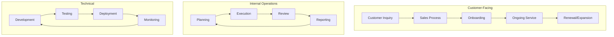
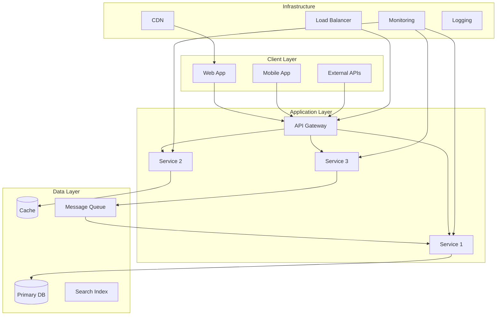
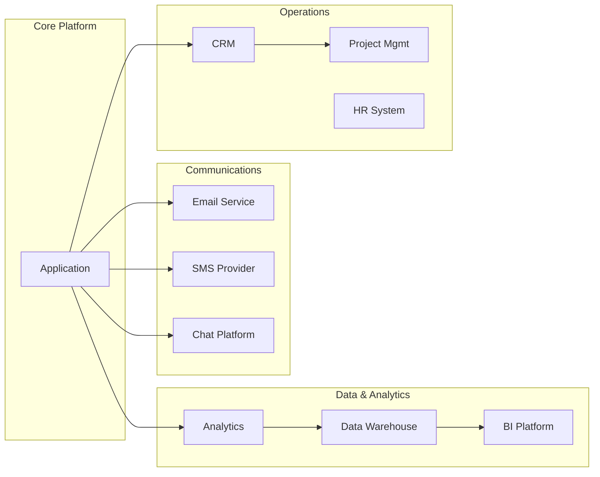
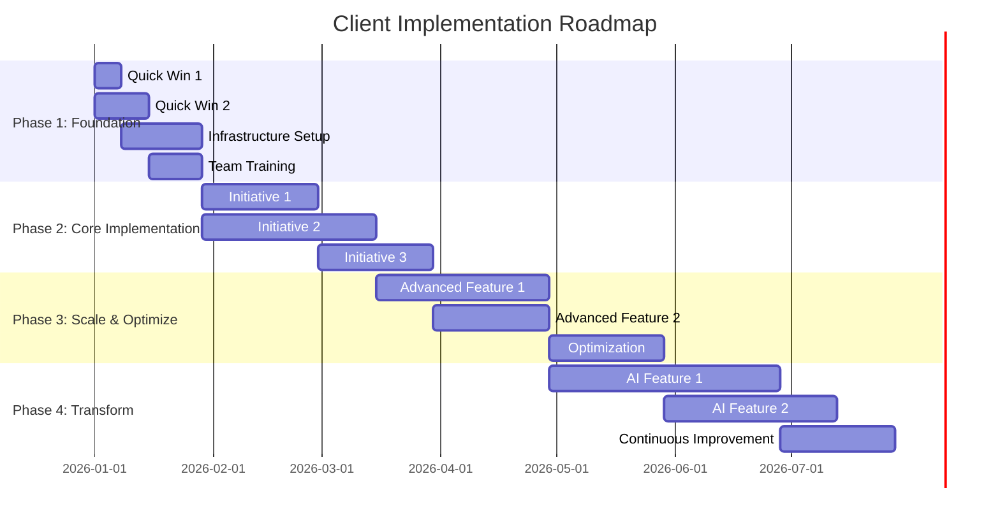

# Final Deliverable Structure

The Commander writes the final assessment to `client-onboarding-report.md` in the current working directory (or a user-specified location). Use the exact structure below. Customize every diagram and table with actual findings; never leave placeholder text such as `[X]` or `[...]` in the delivered file.

```markdown
# Client Onboarding Assessment: [Client Name]

> Prepared by Multi-Agent Assessment System
> Date: [Current Date]
> Classification: Confidential

---

## Table of Contents

1. [Executive Summary](#executive-summary)
2. [Company Profile](#company-profile)
3. [Workflow Assessment](#workflow-assessment)
4. [Technology Landscape](#technology-landscape)
5. [Strategic Recommendations](#strategic-recommendations)
6. [Implementation Roadmap](#implementation-roadmap)
7. [ROI Analysis](#roi-analysis)
8. [Risk Assessment](#risk-assessment)
9. [Appendices](#appendices)

---

## 1. Executive Summary

[3-5 paragraph executive summary that a CEO could read in 2 minutes and understand:
- Current state assessment (one paragraph)
- Key findings and opportunities (one paragraph)
- Recommended path forward (one paragraph)
- Expected outcomes and ROI (one paragraph)]

### Key Metrics at a Glance

| Metric | Current | Target (6 mo) | Target (12 mo) |
|--------|---------|---------------|-----------------|
| Workflow Automation Coverage | X% | Y% | Z% |
| Manual Process Hours/Month | X hrs | Y hrs | Z hrs |
| Tech Stack Health Score | X/100 | Y/100 | Z/100 |
| AI Readiness Score | X/100 | Y/100 | Z/100 |
| Estimated Monthly Savings | $0 | $X | $Y |

---

## 2. Company Profile

### Overview
[Company description, industry, size, stage]

### Current Operations
[How the company currently operates, key business processes]

### Growth Trajectory
[Where the company is headed, strategic priorities]

---

## 3. Workflow Assessment

[Full workflow audit findings from Agent 1, edited for consistency]

### Current Workflow Map


[Customize this diagram based on actual findings]

### Process Maturity Assessment

| Process Area | Maturity Level | Key Finding |
|-------------|---------------|-------------|
| Customer Onboarding | [1-5] | [Finding] |
| Sales Operations | [1-5] | [Finding] |
| Product Development | [1-5] | [Finding] |
| Support/Service | [1-5] | [Finding] |
| Internal Ops | [1-5] | [Finding] |

### Top Bottlenecks

[Ranked list of bottlenecks with impact quantification]

### Automation Opportunity Heat Map

| Process | Manual Effort | Error Rate | Automation Potential | Priority |
|---------|-------------|-----------|---------------------|----------|

---

## 4. Technology Landscape

[Full tech stack assessment from Agent 2, edited for consistency]

### Architecture Overview


[Customize this diagram based on actual findings]

### Integration Ecosystem


[Customize this diagram based on actual findings]

### Technology Health Dashboard

| Category | Score | Status | Action Needed |
|----------|-------|--------|--------------|
| Frontend | X/10 | [text status] | [Action] |
| Backend | X/10 | [text status] | [Action] |
| Database | X/10 | [text status] | [Action] |
| DevOps | X/10 | [text status] | [Action] |
| Security | X/10 | [text status] | [Action] |
| Monitoring | X/10 | [text status] | [Action] |

---

## 5. Strategic Recommendations

[Full strategy from Agent 3, edited for consistency]

### Priority Matrix

```
HIGH IMPACT
    |
    |  [Later]          [Now]
    |  Strategic         Quick Wins
    |  Investments
    |
    |  [Future]         [Next]
    |  Watch &           Medium-term
    |  Evaluate          Initiatives
    |
    +-------------------------->
   LOW                        HIGH
   EASE OF IMPLEMENTATION
```

### Top 10 Recommendations (Ranked)

[Detailed recommendation cards for each, including problem, solution,
technology, team, timeline, investment, expected return, success metrics, risks]

---

## 6. Implementation Roadmap

### Phased Timeline


[Customize with actual initiatives and realistic dates]

### Phase Details

#### Phase 1: Foundation (Weeks 1-4)
**Objective**: Establish quick wins and prepare infrastructure for transformation

| Week | Deliverable | Owner | Dependencies | Success Criteria |
|------|------------|-------|-------------|-----------------|
| 1 | [Deliverable] | [Role] | None | [Criteria] |
| 2 | [Deliverable] | [Role] | [Dep] | [Criteria] |
| 3 | [Deliverable] | [Role] | [Dep] | [Criteria] |
| 4 | [Deliverable] | [Role] | [Dep] | [Criteria] |

**Phase 1 Exit Criteria**:
- [ ] All quick wins implemented and measured
- [ ] Infrastructure ready for Phase 2
- [ ] Team trained on new tools
- [ ] Baseline metrics established

#### Phase 2: Core Implementation (Weeks 5-12)
**Objective**: Deploy primary automation and AI initiatives

[Same table and exit criteria format]

#### Phase 3: Scale & Optimize (Weeks 13-24)
**Objective**: Expand successful implementations and optimize performance

[Same table and exit criteria format]

#### Phase 4: Transform (Weeks 25+)
**Objective**: Deploy transformational AI capabilities

[Same table and exit criteria format]

---

## 7. ROI Analysis

### Investment Summary

| Category | Phase 1 | Phase 2 | Phase 3 | Phase 4 | Total |
|----------|---------|---------|---------|---------|-------|
| Engineering Hours | X | X | X | X | X |
| Tool/Platform Costs | $X | $X | $X | $X | $X |
| Training & Change Mgmt | $X | $X | $X | $X | $X |
| **Total Investment** | **$X** | **$X** | **$X** | **$X** | **$X** |

### Returns Projection

| Category | Month 3 | Month 6 | Month 9 | Month 12 | Annual |
|----------|---------|---------|---------|----------|--------|
| Time Savings (hrs) | X | X | X | X | X |
| Cost Reduction | $X | $X | $X | $X | $X |
| Revenue Impact | $X | $X | $X | $X | $X |
| Risk Reduction | $X | $X | $X | $X | $X |
| **Total Return** | **$X** | **$X** | **$X** | **$X** | **$X** |

### Cumulative ROI Curve

```
ROI ($)
  ^
  |                                          ___----
  |                                   ___---
  |                            ___---
  |                     ___---
  |              ___---
  |       ___---
  |  __--
  |-/
  |/ Break-even
  +--+-----+-----+-----+-----+-----+----> Months
  0  1     3     6     9     12    18
     Phase 1  Phase 2  Phase 3  Phase 4
```

### Payback Analysis
- **Total Investment**: $[X]
- **Monthly Savings (steady state)**: $[X]
- **Break-even Point**: Month [X]
- **12-Month ROI**: [X]%
- **18-Month ROI**: [X]%

---

## 8. Risk Assessment

### Risk Matrix

| # | Risk | Probability | Impact | Severity | Mitigation | Owner |
|---|------|-----------|--------|----------|------------|-------|
| 1 | [Risk] | High/Med/Low | High/Med/Low | Critical/High/Med/Low | [Mitigation] | [Role] |
| 2 | ... | ... | ... | ... | ... | ... |

### Top 5 Risks (Detailed)

For each of the top 5 risks:

#### Risk [N]: [Name]
- **Description**: [What could go wrong]
- **Trigger**: [What would cause this risk to materialize]
- **Impact**: [Quantified impact if it occurs]
- **Probability**: [X]% likelihood
- **Mitigation Strategy**: [How to prevent it]
- **Contingency Plan**: [What to do if it happens]
- **Early Warning Signs**: [How to detect it early]
- **Owner**: [Who is responsible for monitoring]

### Change Management Considerations
- [Key change management risks and strategies]
- [Stakeholder buy-in requirements]
- [Communication plan outline]
- [Training and adoption approach]

---

## 9. Appendices

### Appendix A: Detailed Technology Inventory
[Complete list of all technologies identified]

### Appendix B: Workflow Process Maps
[Detailed process maps for key workflows]

### Appendix C: Competitive Technology Benchmarks
[How the client's stack compares to industry peers]

### Appendix D: Data Sources and Methodology
[How findings were gathered and validated]

### Appendix E: Glossary
[Technical terms and abbreviations used in this report]

---

*This assessment was generated by the Multi-Agent Client Onboarding System using parallel
analysis agents for workflow auditing, technology mapping, and strategic planning.*
```
